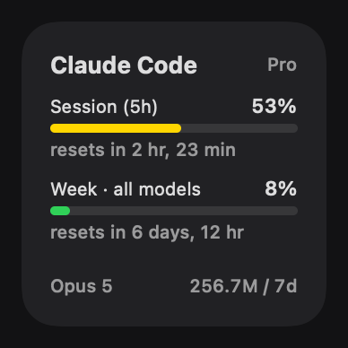
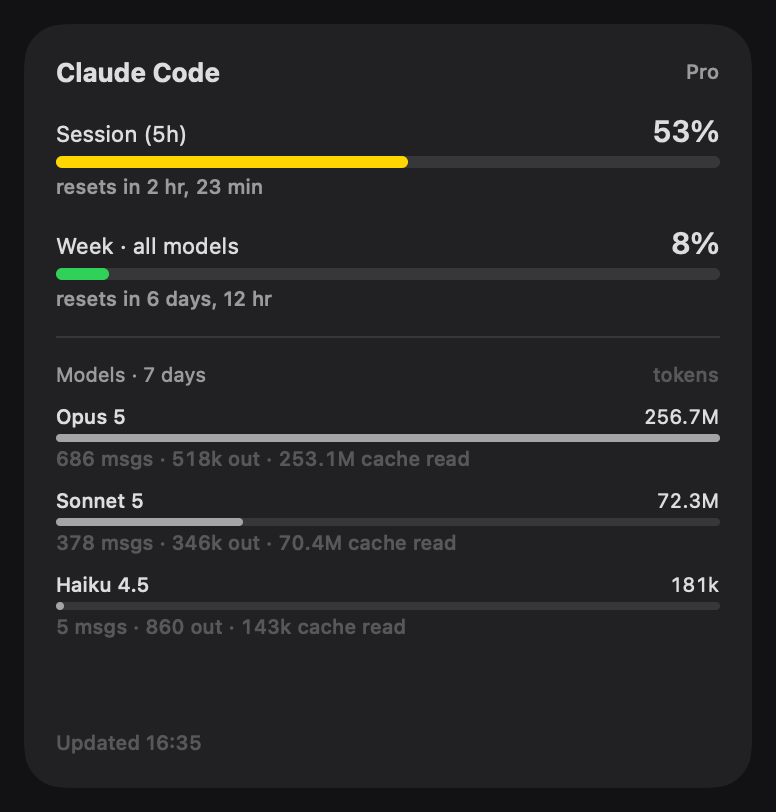

# Claude Usage — macOS widget

Native WidgetKit desktop/Notification Center widget showing Claude Code's
**session (5-hour) limit**, **weekly limit(s)**, and **tokens per model over the
last 7 days**, plus a menu-bar item with the same numbers.

<p align="center">
  
  
</p>
<p align="center">
  
</p>

## How it works

- `ClaudeUsage` (menu-bar app, unsandboxed): every 2 minutes reads Claude Code's
  OAuth token from the keychain (`security find-generic-password -s "Claude Code-credentials"`),
  calls the same usage endpoint `/usage` uses, sums per-model tokens from
  `~/.claude/projects/**/*.jsonl` (deduped by message id + request id — streamed
  chunks repeat the usage block), writes `usage.json` to the App Group container and
  asks WidgetKit to reload when anything changed.
- `ClaudeUsageWidget` (sandboxed extension): renders that snapshot in small,
  medium and large sizes. Widget extensions can't shell out or read `~/.claude`,
  which is why the app does the collecting — keep it running (there's a
  "Launch at Login" toggle in the menu).

Per-model **rate limits** are only shown if the API reports them (Max plans);
on Pro there is one all-models weekly limit, so the per-model section is a token
breakdown from local transcripts.

## Build

```sh
sudo xcodebuild -license accept   # once, if you haven't
./build.sh                        # builds Release, installs ~/Applications/ClaudeUsage.app, launches it
```

Then right-click the desktop (or open Notification Center) → **Edit Widgets** →
**Claude Code Usage**. The app must have been launched at least once for macOS
to register the widget.

Or open `ClaudeUsage.xcodeproj` in Xcode and run the `ClaudeUsage` scheme.
The project is signed "to run locally" (ad-hoc); pick your team under
Signing & Capabilities if you'd rather.

`tools/render-screenshots/render.sh` regenerates the images in `docs/` from the
widget's real SwiftUI views and your current snapshot.

`project.yml` is the source of truth for the Xcode project ([XcodeGen](https://github.com/yonaskolb/XcodeGen));
the generated `ClaudeUsage.xcodeproj` is committed so you don't need XcodeGen installed.
